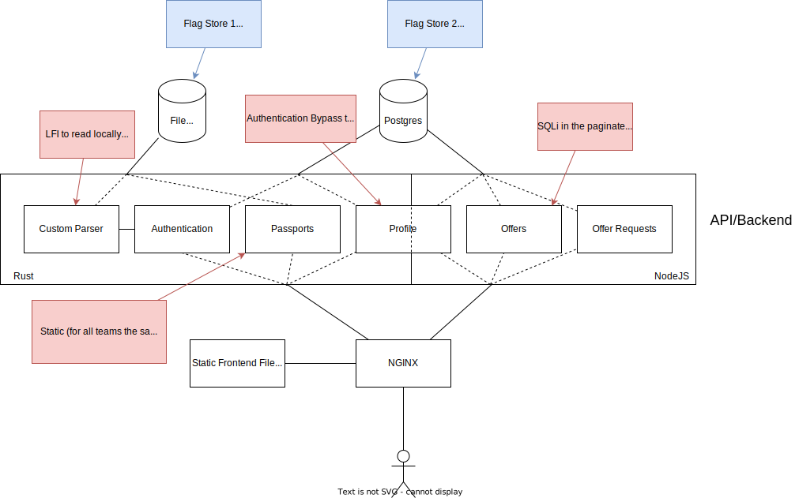

Techbay
=======
As the old world collapsed, also the knowledge of how to use technological devices vanished. Only recently, there has been a rise in interest in tech junk from the past. Some people are interested because such devices look great on the walls; others want to understand how they work to give them a new life; for some, they are precious spare parts to fix various equipment.

Techbay is a platform to support the bartering of technological goods from the past. Everyone with a valid passport can offer and find items.


Description
-----------

The services offers a trading plattform to trade old tech and interesting stuff from the old world.
You can create offers for everyone to see. If you are interested in something, you can request it.
The offerer can then check out all the requests and decide to deny them or accept one.
The lucky one who got accepted, becomes the new owner of the item.
But not everyone can join this community of traders. You need a proper passport for security reasons!


Technical Overview
------------------

The backend is split between a Rust backend and a NodeJS backend. The Rust backend will contain a custom parser, the authentication logic and a part of the profile API. It will only be deployed as a binary without the code.
The NodeJS backend will contain the API for the offers, requests and the other part of the profile API.
The frontend is written in VueJS and will be served from static files from an NGINX reverse proxy.
The NGINX reverse proxy will forward the requests to the two backends, based on the URL.

See the architecture below.




Flag Stores
-----------
The service has two flag stores. Flag ids represent the id of users with a flag.

### Flag Store 1
------------
During registration a user has to provide username, password and a passport in a custom format. The passport is stored within files and will be parsed during upload.
The passport contains the first flag store.

### Flag Store 2
Every user can set address, telephone number and a status on their profile with additional visibility settings. This information is stored in the postgres database. The status field will contain the second flag store.


Vulnerabilities
---------------
The service has four vulnerabilities. Two for *flag store 1* and two for *flag store 2*.

### Flag store 1 - Vulnerability 1
During the registration process the passport will be parsed by a custom parser, which will have a hidden feature to read local files. This feature will only be visible in the binary file and needs to be found via reverse engineering.

### Flag store 1 - Vulnerability 2
The Rust backend contains an endpoint that lets someone retreive the passport files. The endpoint will check if the JWT token contains the entry `admin: true`. But since there is no intended functionality of how to get this entry, the only way will to forge a JWT token with the hardcoded private key, that will be the same for every team.

### Flag store 2 - Vulnerability 1
The nodejs backend contains three "forgotten" (because they are not used in the frontend) API calls to change the profile visibility settings. The API call to change the visibility of the status will just use the user id from the auth/JWT token without checking the signature. Everybody can therefore change the visibility setting of the telephone field for other users by sending a forged/unsigned JWT token.

### Flag store 2 - Vulnerability 2
The offer API provides a endpoint to get a list of offers paginated. This contains a blind SQLi via a injected parameter. The offer data and the profile data is stored in two separate logical databases, which will only make it possible to read the offer information and therefore only the third flag store.


Patches
-------

### Patch for Flag Store 1 - Vulnerability 1
The vulnerability will only be able to patched by modifying the binary and patch out the branch that calls the LFI function.

When decompiling with ghidra in the function ```backend_rust::parser::render``` the goal is to archive, that the if block is never reached, because in the else block the mime_type is checked and if png the file is written to storage. This can be done by either changing the comparison at Offset ```0x0025c270``` so it never jumps at the next instruction.
Otherwise the JZ address at Offset ```0x0025c276``` could be just changed to jump just one instruction ahead instead to the parsing block.

Second one is easier with ghidra patch instruction because the address can be directly inputed.

### Patch for Flag Store 1 - Vulnerability 2
To patch this vulnerability a file called ```private.key``` needs to be deployed to backend_rust and backend_node.
This file has to contain a randomly generated alphanumeric string of maximum length 32 which will be used as the JWT secret instead of the hardcoded one.

### Patch for Flag Store 2 - Vulnerability 1
The vulnerability could be patched in NGINX by not forwarding the routes for these "forgotten" API endpoints.

### Patch for Flag Store 2 - Vulnerability 2
Using prepared statements instead of a custom query perpare logic.